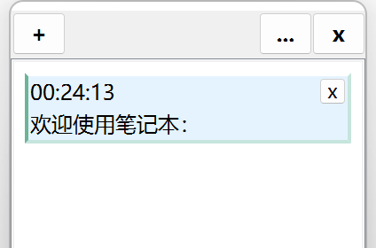
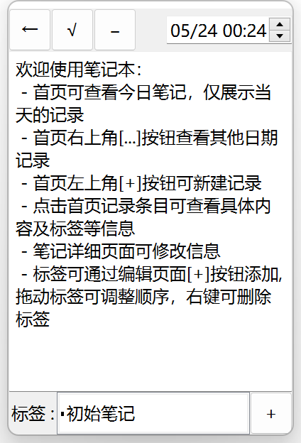
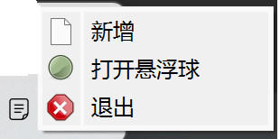

# TodayNotes 今日记事
- pyside6  |  python
## 简介
今日记事：

  比较简易的桌面记事清单，可以添加文字，可以为记录增加标签，列表显示当日记录，`笔记列表`界面可查看历史记录，具备桌面托盘图标，悬浮球和 `屏幕吸边`，方便呼出新增页
  
## 特色
- 内容中可以有图片：文本中可以粘贴图片或者拖入图片文件(v2.1版本后)
- 悬浮球可以吸附屏幕边，方便呼出编辑界面

### 使用介绍

#### 主界面为<u>`今日笔记列表`</u>界面
- `[+]`按钮:新增笔记
- `[...]`按钮: 打开笔记列表(可查看历史记录/按条件筛选笔记)
- `[x]`关闭按钮: 可选择最小化至托盘或直接退出程序
- 界面展示当日笔记，并按时间倒序排列
- 点击条目查看具体内容

#### `新增笔记`界面
- 目前只能显示和录入文字(后续添加图片支持)
- 时间选择器可编辑具体时间(影响排序和筛选)
- 标签栏显示已添加的标签，点击标签栏`[+]`按钮新增标签，仅文字，可拖动标签进行排序
- 录入内容点击`[√]`提交，`[-]`删除笔记

#### `笔记列表` 界面
- 可按时间筛选笔记列表，右键可切换时间选择模式
- 可按条件筛选笔记内容，搜索框中可录入类似sqlite的筛选语句
- 模糊搜索类似于`"where content LIKE '%{QueryText}%'"`
- 图片在文本中仅有文件id使用html``标签表示,可输入`图片`或`img`筛选内容中有图片的条目
- 点击条目可查看具体信息

#### `悬浮球` 和 `托盘图标`显示
- 悬浮球`[+]`可打开新增界面，`[...]`为今日笔记列表，可吸边(屏幕四角为单方块吸边图案，四边为两个方块吸边图案)

- 点击托盘菜单可呼出今日列表界面，右键可选择打开悬浮球，退出程序等

> 运行是会在当前程序目录产生一个`data`文件夹存放「**conf.ini**」配置文件及「**note.sqlite**」数据文件
>
> 配置存放的为按钮默认选项 ：
> - default_close_flag：关闭按钮的标识(0:无/1:关闭程序/2:最小化到托盘)
> - default_sball_flag: 最小化至托盘后是否显示悬浮球 (0:无-未设置/1:手动显示/2:自动显示)
> - v2.1版本添加配置项: 
>   - root_path: 程序存储根路径，默认 `data/` 当前路径data目录下
>   - use_cus_view：默认`0`, 使用系统图片查看器;其他值为使用本程序查看器;如果使用系统查看器，会生成临时图片文件，临时文件保存在 root_path+`temp/images`文件夹下

#### 打包
- 运行`build`目录下`setup_pyinstaller.py`脚本进行打包
- 启动入口位于`mainView.py`文件,运行mainView.py文件即可

#### 以后改进(随缘更新)
- ~~预计支持编辑界面支持图片贴入~~ (v2.1版本后已支持)
- 预计支持数据导入导出功能(Excel格式)
- 预计支持透明度设置
- 预计优化笔记列表筛选器
- 预计美化ui
- 预计支持修改部分主体样式背景等

·本项目是学习pyside一周后练手作品·

### 更新日志
> v2.3.5版本更新 2023-06-23：
> - 新增:顶部栏右键窗口置顶选项

> v2.3.3版本更新 2022-06-25：
> - 新增:添加标签时增加快捷列表，展示所有可用标签

> v2.3.1版本更新 2022-06-04：
> - 新增:粘贴带标题的超链接网址时重新格式化超链接标题,可以 `Ctrl + 左键` 点击超链接打开， 使用默认浏览器打开链接网址

> v2.3版本更新 2022-06-02：
> - 修复图片点击无法查看问题
> - 添加查看图片点击防抖
> - 修复保存后无法查看图片问题

> v2.2版本更新 2022-05-31：
> - 修复编辑界面贴入带样式的文字报错问题，目前可以贴入带样式文字，但是不支持编辑样式
> - 修复因循环调用所致的内存泄漏问题

> v2.1版本更新 2022-5-30：
> - 文本编辑界面加入图片插入功能，可粘贴或拖入图片
> - 新增图片查看器界面，点击文本中的图片即可查看
> - 新增配置项，可指定文件存储根路径和查看器标识选项
> - 数据表新增附件表，存储图片文件